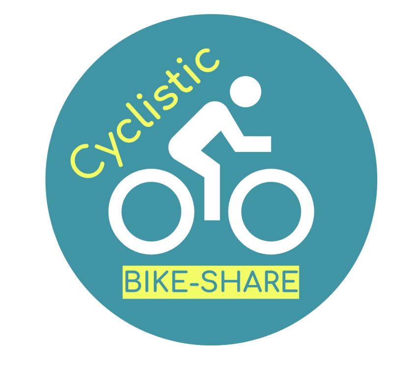
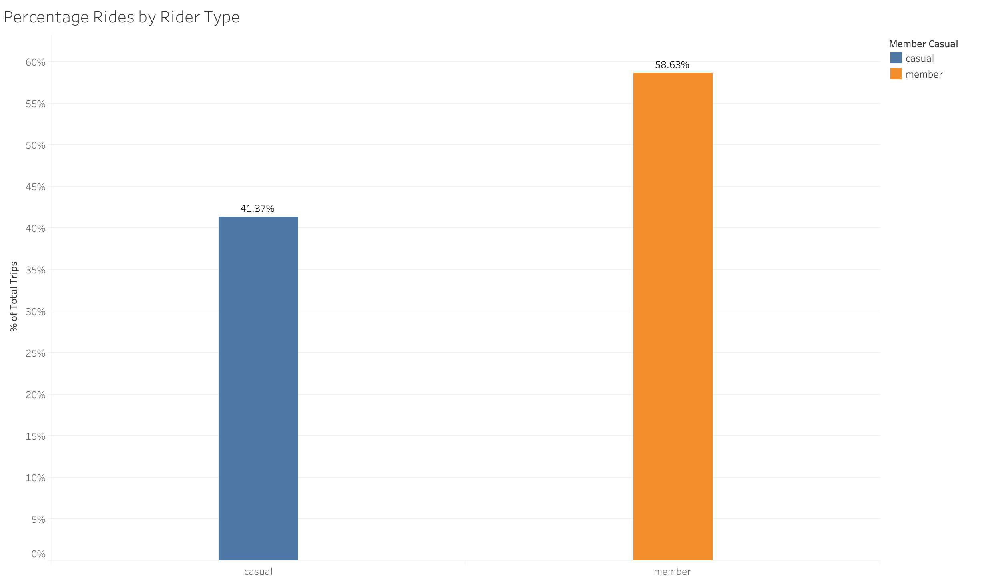
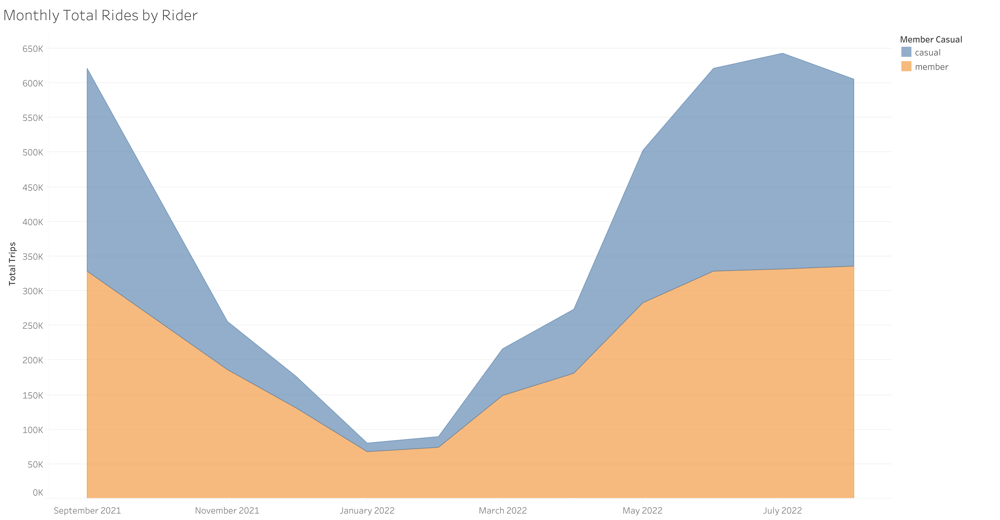
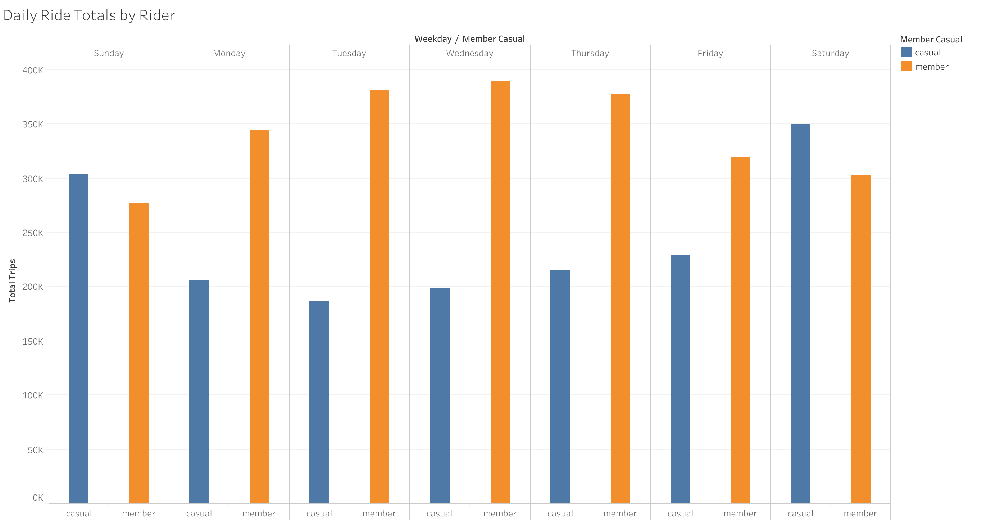
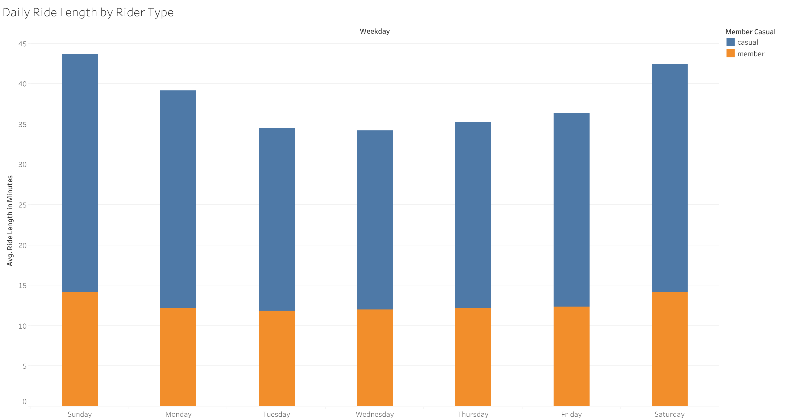
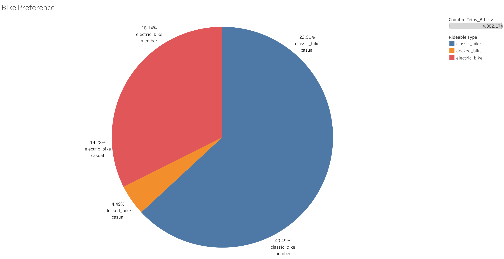
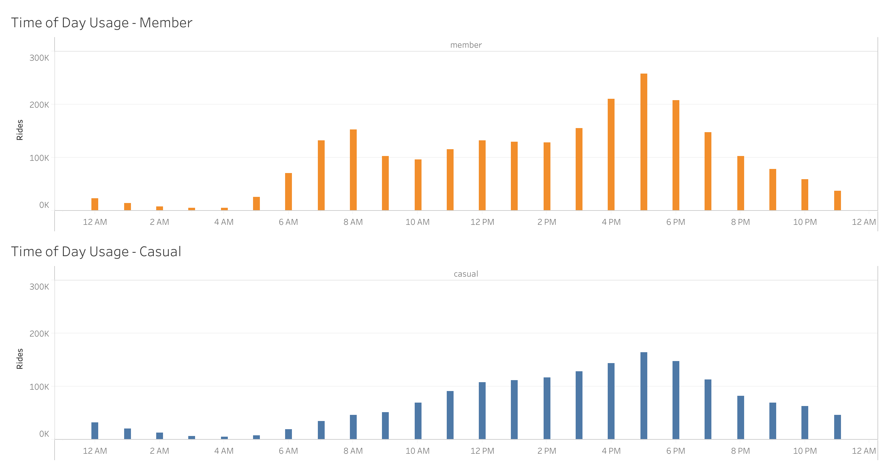

## Cyclistic: A bike-share analysis case study


```{r}

```


### Scenario
I am a junior data analyst working in the marketing analyst team at Cyclistic, a bike-share company in Chicago.  The director of marketing (Lily Moreno) believes the company's future success depends on maximizing the number of annual memberships.  Therefore, my team wants to understand how casual riders and annual members use Cyclistic bikes differently.  From these insights, my team will design a new marketing strategy to convert casual riders into annual members.  But first, Cyclistic executives must approve my recommendations, so they must be backed up with compelling data insights and professional data visualizations.


### Company Background
In 2016, Cyclistic launched a successful bike-share offering. Since then, the program has grown to a fleet of 5,824 bicycles that are geotracked and locked into a network of 692 stations across Chicago. The bikes can be unlocked from one station and returned to any other station in the system anytime.

Until now, Cyclistic’s marketing strategy relied on building general awareness and appealing to broad consumer segments. One approach that helped make these things possible was the flexibility of its pricing plans: single-ride passes, full-day passes, and annual memberships. Customers who purchase single-ride or full-day passes are referred to as casual riders. Customers who purchase annual memberships are Cyclistic members.


### Step 1: Ask
#### Problem to be solved
Cyclistic’s finance analysts have concluded that annual members are much more profitable than casual riders. Although the pricing flexibility helps Cyclistic attract more customers, Moreno believes that maximizing the number of annual members will be key to future growth. Rather than creating a marketing campaign that targets all-new customers, Moreno believes there is a very good chance to convert casual riders into members. She notes that casual riders are already aware of the Cyclistic program and have chosen Cyclistic for their mobility needs.  

Moreno has set a clear goal: Design marketing strategies aimed at converting casual riders into annual members. In order to do that, however, the marketing analyst team needs to better understand how annual members and casual riders differ, why casual riders would buy a membership, and how digital media could affect their marketing tactics. Moreno and her team are interested in analyzing the Cyclistic historical bike trip data to identify trends.
<br>

#### Business task
* How do annual members and casual riders use Cyclistic bikes differently?
<br>

#### Key Stakeholders
* Lily Moreno: Director of Marketing
* Executive leadership team for Cyclistic
<br>

### Step 2: Prepare
#### Data Origination
* Cyclistic data located here: https://divvy-tripdata.s3.amazonaws.com/index.html
* Data license provided by Motivate InternatIONAL Inc under the following license: https://ride.divvybikes.com/data-license-agreement
<br>

#### Data Preparation
I chose to complete my data preparation and cleaning using R Studio.  Here are the packages I"m using for this project:
```{r}
library(tidyverse)
library(ggplot2)
library(readr)
library(dplyr)
library(stringr)
library(lubridate)
library(data.table)
library(janitor)
library(tidyr)
```

Next, I loaded in the CSV data files that I'll be working from.
```{r}
Trips_Sept_21 <- read_csv("202109-divvy-tripdata.csv")
Trips_Oct_21 <- read_csv("202110-divvy-tripdata.csv")
Trips_Nov_21 <- read_csv("202111-divvy-tripdata.csv")
Trips_Dec_21 <- read_csv("202112-divvy-tripdata.csv")
Trips_Jan_22 <- read_csv("202201-divvy-tripdata.csv")
Trips_Feb_22 <- read_csv("202202-divvy-tripdata.csv")
Trips_Mar_22 <- read_csv("202203-divvy-tripdata.csv")
Trips_Apr_22 <- read_csv("202204-divvy-tripdata.csv")
Trips_May_22 <- read_csv("202205-divvy-tripdata.csv")
Trips_Jun_22 <- read_csv("202206-divvy-tripdata.csv")
Trips_Jul_22 <- read_csv("202207-divvy-tripdata.csv")
Trips_Aug_22 <- read_csv("202208-divvy-tripdata.csv")
```

After getting all of the CSVs loaded I'm checking the data structure for each data set using the str() function.
```{r}
str(Trips_Sept_21)
str(Trips_Oct_21)
str(Trips_Nov_21)
str(Trips_Jan_22)
str(Trips_Feb_22)
str(Trips_Mar_22)
str(Trips_Apr_22)
str(Trips_May_22)
str(Trips_Jun_22)
str(Trips_Jun_22)
str(Trips_Aug_22)
```

```{r}
compare_df_cols(Trips_Sept_21, Trips_Oct_21, Trips_Nov_21, Trips_Dec_21, Trips_Jan_22, Trips_Feb_22, Trips_Mar_22, Trips_Apr_22, Trips_May_22, Trips_Jun_22, Trips_Jul_22, Trips_Aug_22, return = "mismatch")
```
The above compare_df_cols() function above shows us a comparison of the data types for each column in each data frame.  In this case we find out that the Trips_Oct_21 data set doesn't match the others for the ended_at and started_at columns.

I'll change the data type for those mismatched columns in Trips_Oct_21 with the following:
```{r}
Trips_Oct_21$started_at <- lubridate::mdy_hm(Trips_Oct_21$started_at)
Trips_Oct_21$ended_at <- lubridate::mdy_hm(Trips_Oct_21$ended_at)
```

Now I'll re-check the data types for the columns in each data set using the compare_df_cols() function again.
```{r}
compare_df_cols(Trips_Sept_21, Trips_Oct_21, Trips_Nov_21, Trips_Dec_21, Trips_Jan_22, Trips_Feb_22, Trips_Mar_22, Trips_Apr_22, Trips_May_22, Trips_Jun_22, Trips_Jul_22, Trips_Aug_22, return = "mismatch")
```
The data types and column numbers now match for each data set.


### Step 3: Process
I combined all of the individual data sets into a single data set called Trips_All.
```{r}
Trips_All <- rbind(Trips_Sept_21, Trips_Oct_21, Trips_Nov_21, Trips_Dec_21, Trips_Jan_22, Trips_Feb_22, Trips_Mar_22, Trips_Apr_22, Trips_May_22, Trips_Jun_22, Trips_Jul_22, Trips_Aug_22)
```

To double-check the full data set, Trips_All, I've used the str() function.
```{r}
str(Trips_All)
```

We see that the Trips_All data set has ~5.8 million rows with each row representing a bike ride, across 13 columns.  We can also take a look at the first 6 rows of data using the head() function.
```{r}
head(Trips_All)
```

I removed rows with null values.
```{r}
Trips_All <- na.omit(Trips_All)
```
Re-checking the Trips_All data set using the str() function, we now have ~4.5 million rows or unique bike rides, still across 13 columns.


As per the instructions in this case study, I'll create two new columns: ride_length and day_of_week.  I used the difftime() function to create a new column called ride_length whereby I subtracted the started_at time from the ended_at time, establishing the unit of meassure as minutes.  This will give us the span of time for each unique bike ride.
```{r}
Trips_All$ride_length <- difftime(Trips_All$ended_at, Trips_All$started_at, units = "min")
```

We can check this by using the str() function:
```{r}
str(Trips_All)
```

For the day_of_week column I used the weekdays() function:
```{r}
Trips_All$weekday <- weekdays(Trips_All$started_at)
```

Verify using
```{r}
str(Trips_All)
```

Export the data from R Studio to CSV where I'll work in Tableau for analysis and visualizations.
```{r}
write.csv(Trips_All, "Trips_All.csv", row.names=FALSE)
```


### Step 4: Analyze
Below are some of the charts and graphs from Tableau visualizing my main data findings.  
<br>  

#### Total Percentage of Rides by Rider Type
Casual members make up 58.6% of the total amount of rides.  This comes out to just shy of 2.4 million unique bike usages from the Members subscription.  Casual riders accounted for 41.3% of the total annual rides, giving them ~1.69 million bike usages.
```{r}

```
<br>
<br>  

#### Monthly Total Rides by Rider
Moving from an annual view to a monthly view we find that usage for both Members and Casual riders are highest in the May - October months.  The largest segment of growth during these months is the Casual rider.  Although we also notice a bump in Member rides during this time, growth and decay of Member activity is far more than subtle than that of our Casual riders. 
```{r}

```
<br>
<br>  

#### Daily Ride Totals by Rider
Moving from a monthly view to the weekly, we find that Members bike usage is heaviest during the week whereas the highest usage for Casual riders is on the weekends.
```{r}

```
<br>
<br>  

#### Daily Average Ride Length by Rider Type
Casual riders had an average ride of 36 minutes, almost three times the average ride length of Members.  Members had an average ride length of 13 minutes.
```{r}

```
<br>
<br>  

#### Bike Preference
When it comes to bike preference for our customers, Classic Bike was the most used by both Members (40.5%) and Casual riders (22.5%).  Classic bikes are being used 63% of the time overall.  Electric bikes were the second most popular, being used by our Members 18% of the time and Casual riders 14% of the time.  Electric bikes make up nearly a third of all bike usage.  Docked bikes were only being used ~5% of tthe time and only by our Casual riders.
```{r}

```
<br>
<br>  

#### Average Bike Usage by Time of Day
When looking at bike usage by time of day, we see that Member usage has a spike at 8am and 5pm while Casual riders have a slow build to a 5pm peak usage.  This also shows that, overall, lunch time to 7pm is the heaviest block of usage with 4pm - 7pm being the busiest time segment
```{r}

```
<br>
<br>  

### Step 5: Share
#### Key Findings
* Members make up 58% of the total rides annually.
* Total bike usage sees a sharp decline from November-February from Members and Casual riders.  However, Casual ridership experiences a strong drop-off in those colder months as well as the largest ramp-up in the warmer months.  Member ridership has the same drop-off and ramp-up points as the Casual riders but not nearly as steep.
* Member bike usage is highest during the week while Casual riders have the highest usage on the weekends.
* Average ride length for Casual riders is double that of Members, and increases during weekend days.  Average ride length for Members stays very consistent all week, averaging ~13 minutes. 
* The classic bike was the main choice for both Members and Casual riders, being selected two-thirds of the time.  The electric bikes were the second choice for both groups, being selected ~1/3 of the time.  Docked bikes represented less than 5% of the choice and was only selected by Casual riders.
* Heaviest usage time overall is 4pm - 6pm.  Members also see a usage increase between 7am - 8am.  
<br>

### Step 6: Act
#### Suggestions / Recommendations
* Offer a Loyalty discount to upgrade to an annual membership based on their individual history with using the bike-share provided by Cyclistic.
* Offer an upgrade discount for Casual riders based on their individual amount of usage
* Create a survey for Casual riders to further understand their bike needs and usage.
<br>

#### Beyond the current data
* It would be great to know the percentage breakdown of single-ride usage to full-day pass usage for the Casual riders.  Having this information could help guide the analysis and recommendations for coverting Casual riders to Members.
* We know that there are 5,824 bikes in the Cyclistic network.  What we don't have data on is the breakdown of how many of each bike are in Cyclists rotattional inventory.  Having this information could be useful in considering whether adding more of the popular bike types in the busiest locations would help convert Casual riders to an annual membership.